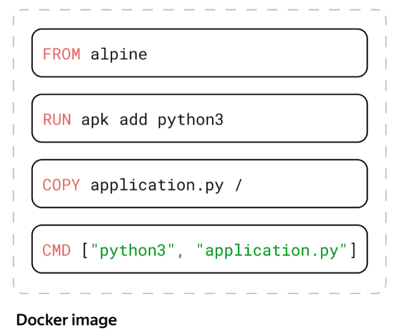

# How to create docker image from scratch
1. Prepare Dockerfile with instructions

2. Prepare application. For example, "application.py"
3. For building the image execute the command "docker build . --tag my_image"
4. For running container execute the commang "docker run library/my_image:latest"